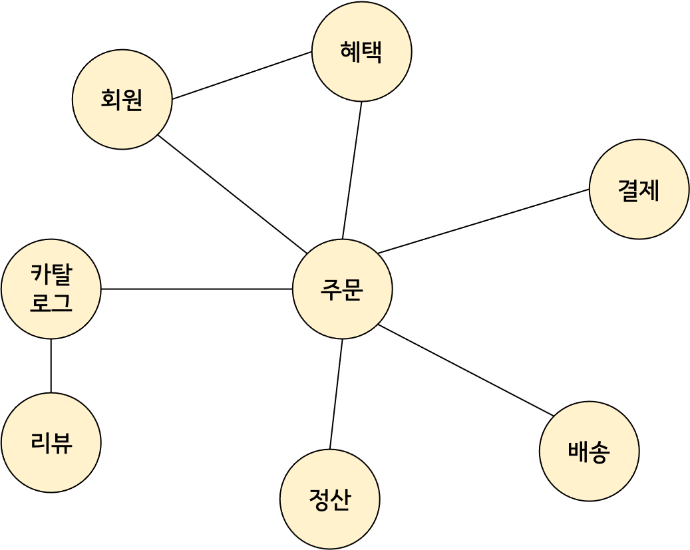

# 01. 도메인 모델 시작하기

## 도메인이란?

- ‘온라인 서점’을 개발자 입장에서 바라보면 온라인 서점은 구현해야 할 소프트웨어 대상이 된다
- ‘온라인 서점’은 소프트웨어로 해결하고자 하는 문제 영역, 즉 ‘도메인’에 해당된다
- 하나의 도메인은 다시 여러 하위 도메인이로 나눌 수 있다

  

- 특정 도메인을 위한 소프트웨어라고 해서, 도메인이 제공해야 할 모든 기능을 직접 구현하지는 않는다

  

- 도메인마다 고정된 하위 도메인이 존재하는 것은 아니다
- 하위 도메인을 어떻게 구성할지 여부는 상황에 따라 달라진다


## 도메인 전문가와 개발자 간 지식 공유

- 개발자는 **요구사항**을 분석하고 설계하여 코드를 작성하며 테스트하고 배포한다
- 이 과정에서 요구사항은 ‘첫 단추’라고 할 수 있다
    - 즉, 요구사항을 올바르게 파악하지 못하면, 잘못 개발할 수 있다
- **따라서, 코딩에 앞서 요구사항을 올바르게 이해하는 것이 중요하다**
    - 요구사항을 잘못 이해하면 변경하거나 다시 만들어야 할 코드가 많아진다
    - 또한, 소프트웨어를 만드는데 실패하거나 일정이 밀릴 수도 있다
- 요구사항을 올바르게 이해하려면 어떻게 해야 할까?
    - 개발자와 전문자가 ‘직접’ 대화한다
    - 내용을 전파하는 중간 전달자가 많으면, 정보가 왜곡된다
    - 도메인 전문가 만큼은 아니어도, 개발자는 도메인 지식을 갖춰야 한다


## 도메인 모델

- ‘도메인 모델’은 기본적으로, 특정 도메인을 개념적으로 표현한 것이다
- 도메인 모델을 사용하면 여러 관계자들이 동일한 모습으로 도메인을 이해하게 된다
- 도메인 모델의 여러가지 형태
    - 객체 기반의 도메인 모델

      

        - 객체 모델은 도메인이 제공하는 기능과 주요 데이터 구성을 쉽게 파악할 수 있다
    - 상태 다이어그램을 이용한 도메인 모델

      

        - 상태 전이를 쉽게 파악할 수 있다
    - 이외에도, 관계가 중요한 도메인이라면 그래프를 이용하여 모델링 할수도 있고, 계산 규칙이 중요하다면 수학 공식을 활용해서 도메인 모델을 만들수도 있다
    - 도메인을 이해하는 데 도움이 된다면, 표현 방식이 무엇인지는 중요하지 않다
- 도메인 모델은 기본적으로 도메인 자체를 이해하기 위한 개념 모델이다

## 도메인 모델 패턴

- 어플리케이션의 아키텍처는 4개의 영역으로 구성된다

  


| 영역 | 설명 |
| --- | --- |
| 표현 | - 요청을 처리하고 정보를 보여준다 |
| 응용 | - 요청한 기능을 실행한다<br> - **업무 로직을 직접 구현하지 않는다**<br>- 도메인 계층을 조합해서 기능을 실행한다 |
  | 도메인 | - **시스템이 제공해야 할 도메인 규칙을 구현한다** |
  | 인프라스트럭처 | - 데이터베이스나 메시징 시스템과 같은 외부 시스템과의 연동을 처리한다 |

### 도메인 모델

- 지금부터 설명하는 ‘도메인 모델’은 어플리케이션 아키텍처 상의 도메인 계층을 객체 지향 기법으로 구현하는 패턴을 말한다
- **‘도메인 계층’은 도메인의 핵심 규칙을 구현한다**
    - ‘주문’ 도메인의 경우, ‘*출고 전에 배송지를 변경할 수 있다*’ 또는 ‘*주문 취소는 배송 전에만 할 수 있다*’ 라는 규칙을 구현한 코드가 도메인 계층에 위치하게 된다
- 이런 도메인 규칙을 객체 지향 기법으로 구현하는 패턴이 ‘**도메인 모델 패턴**’이다

### 도메인 모델 패턴 예시

```java
public class Order {
	private OrderState state;
	private ShippingInfo shippingInfo;

	public void shangeShippingInfo(ShippingInfo newShippingInfo) {
		if (!state.isShippingChnageable()) {
			throw new IllegalStateException("can't change shipping in " + state);
		}
		this.shippingInfo = newShippingInfo;
	}

	:
}
```

```java
public enum OrderState {
	PAYMENT_WAITING {
		public boolean isShippingChangeable() {
			return true;
		}
	},
	PREPARING {
		public boolean isShippingChangeable() {
			return true;
		}
	},
	SHIPPPED, DELIVERING, DELIVERY_COMPLETED;

	public boolean isShippingChangeable() {
		return false;
	}
	
}
```

- 이 코드는 주문 도메인의 일부 기능을 도메인 모델 패턴으로 구현한 것이다
- `OrderState`는 배송지를 변경할 수 있는지를 검사하는 메소드를 제공하고 있다
    - 즉, ‘*주문 대기중이거나 상품 준비중에는 배송지를 변경할 수 없다*’는 도메인 규칙을 구현하고 있다
    - 하지만, 배송지 변경 가능 여부를 판단하는 규칙에 다른 정보가 필요하다면 `OrderState`만으로는 배송지 변경가능 여부를 판단할 수 없다
- `Order`는 배송지를 변경할 수 있는 경우에만 실제 배송지 정보를 변경하는 메소드를 제공하고 있다
    - 큰 틀에서 보면 `OrderState`는 `Order`에 속한 데이터다
    - 따라서 배송지 변경 가능 여부를 판단하는 기능을 `Order`로 이동시킬 수 있다
- 배송지 변경 가능 여부를 판단하는 기능이 `OrderState` 에 있든 `Order` 에 있든.. 주문과 관련된 업무 규칙을 주문 도메인 모델에서 구현한다는 점이 중요하다
- 즉, **핵심 규칙을 구현한 코드는 도메인 모델에만 위치한다**

## 도메인 모델 도출

- 도메인을 모델링할 때 가장 기본이 되는 작업 : 모델을 구성하는 핵심 구성요소, 규칙, 기능 찾기
- **즉, ‘요구사항’에서 시작한다**

### 주어진 요구사항으로 도메인 모델 도출하기

요구사항

1. *최소 한 종류 이상의 상품을 주문해야 한다*
2. *한 상품을 한 개 이상 주문할 수 있다*
3. *총 주문 금액은 각 상품의 구매 가격 합을 모두 더한 금액이다*
4. *각 상품의 구매 가격 합은 상품 가격에 구매 개수를 곱한 값이다*
5. *주문할 때 배송지 정보를 반드시 지정해야 한다*
6. *배송지 정보는 받는 사람 이름, 전화번호, 주소로 구성된다*
7. *출고를 하면 배송지를 변경할 수 없다*
8. *출고 전에 주문을 취소할 수 있다*
9. *고객이 결제를 완료하기 전에는 상품을 준비하지 않는다*
- 요구사항을 통해서 ‘주문’은 ‘출고 상태 변경’, ‘배송지 정보 변경’, ‘주문 취소’, ‘결제 완료’ 기능을 제공한다는 것을 알 수 있다

    ```java
    public class Order {
    	public void changeShipped() {...}
    	public void changeShippingInfo(ShippingInfo shippingInfo) {...}
    	public void cancel() {...}
    	public void completePayment() {...}
    }
    ```

- 2, 4번 요구사항 구현

  > 한 상품을 한 개 이상 주문할 수 있다<br>
    각 상품의 구매 가격 합은 상품 가격에 구매 개수를 곱한 값이다
  >
    - 주문 항목을 표현하는 `OrderLine`은 적어도 주문할 상품, 상품의 가격, 구매 개수를 포함해야 한다
    - 각 구매 항목의 구매 가격도 제공해야 한다

    ```java
    public class OrderLine {
    	private Product product;
    	private int price;
    	private int quantity;
    	private int amounts;
    
    	public OrderLine(Product product, int price, int quantity) {
    		this.product = product;
    		this.price = price;
    		this.quantity = quantity;
    		this.amounts = calculateAmounts();
    	}
    
    	private int calculateAmounts() {
    		return price * quantity;
    	}
    
    	public int getAmounts() {...}
    }
    ```

- 1, 3, 5번 요구사항 구현

  > 최소 한 종류 이상의 상품을 주문해야 한다<br>
    총 주문 금액은 각 상품의 구매 가격 합을 모두 더한 금액이다<br>
    주문할 때 배송지 정보를 반드시 지정해야 한다
  >
    - Order는 최소 한 개 이상의 OrderLine을 가져야 하며, 총 구매 금액을 OrderLine에서 구할 수 있다
    - Order를 생성할 때, OrderLine 목록 뿐 아니라 배송지 정보도 함께 전달해야 한다

    ```java
    public class Order {
    	private List<OrderLine> orderLines;
    	private ShippingInfo shippingInfo;
    	private Money totalAmounts;
    	
    	public Order(List<OrderLine> orderLines, ShippingInfo shippingInfo) {
    		setOrderLines(orderLines);
    		setShippingInfo(shippingInfo);
    	}
    
    	private void setOrderLines(List<OrderLine> orderLines) {
    		verifyAtLeastOneOrMoreOrderLines(orderLines);
    		this.orderLines = orderLines;
    		calculateTotalAmounts();
    	}
    
    	private void setShippingInfo(ShippingInfo shippingInfo) {
    		// '배송지 정보 필수'라는 도메인 규칙을 구현하고 있다
    		if (shippingInfo == null) {
    			throw new IllegalArgumentException("no ShippingInfo");
    		}
    		this.shippingInfo = shippingInfo;
    	}
    
    	private void verifyAtLeastOneOrMoreOrderLines(List<OrderLine> orderLines) {
    		if (orderLines == null || orderLines.isEmpty()) {
    			throw new IlleagalArgumentException("no OrderLine");
     		}
    	}
    
    	private void calculateTotalAmounts() {
    		int sum = orderLines.stream().mapToInt(OrderLine::getAmounts).sum();
    		this.totalAmounts = new Money(sum);
    	}
    
    	:
    }
    ```

- 7, 8, 9번 요구사항 구현

  > 출고를 하면 배송지를 변경할 수 없다<br>
    출고 전에 주문을 취소할 수 있다<br>
    고객이 결제를 완료하기 전에는 상품을 준비하지 않는다
  >
    - 주문은 최소한 출고 상태를 표현할 수 있어야 한다
    - 배송지 변경이나 주문 취소 기능은 주문 상태를 검사해야 한다

    ```java
    public enum OrderState {
    	PAYMENT_WAITING, PREPARING, SHIPPED, DELIVERING, DELIVERY_COMPLETED, CANCELD;
    }
    ```

    ```java
    public class Order {
    		:
    		private OrderState state;
    		:
    
    		public void changeShippingInfo(ShippingInfo newShippingInfo) {
    			verifyNotyetShipped();
    			setShippingInfo(newShippingInfo);
    		}
    
    		public void cancel() {
    			verifyNotYetShipped();
    			this.state = OrderState.CANCELED;
    		}
    
    		private void verifyNotYetShipped() {
    			if (state != OrderState.PAYMENT_WAITING && state != OrderState.PREPARING) {
    				throw new IllegalStateException("already shipped");
    			}
    		}
    }
    ```


## 엔티티와 밸류

- 요구사항에서 도출한 주문 도메인 모델은 크게 ‘엔티티’와 ‘밸류’로 구분된다


- **‘엔티티’와 ‘밸류’를 제대로 구분해야 한다**
    - 그래야 도메인을 올바르게 설계하고 구현할 수 있다
    - 이 둘의 차이를 명확하게 이해하는 것은 도메인을 구현하는 데 있어 중요하다

### 엔티티

- 가장 큰 특징 : ‘식별자'가 있다
- 앞서 주문에 해당하는 클래스가 `Order`이므로 `Order`가 ‘엔티티’가 되며 주문번호를 속성으로 갖게 된다
- ‘식별자’는 바뀌지 않는다
    - 주문에서 배송지 주소가 바뀌거나, 상태가 바뀌더라도 주문번호는 바뀌지 않는다
- **따라서, ‘식별자’로 동일성을 판단한다**
    - 엔티티의 식별자는 고유하기 때문에 두 엔티티의 객체의 식별자가 같으면 두 엔티티는 같다고 판단한다

    ```java
    public class Order {
    	private String orderNumber;
    	@Override
    	public boolean equals(Object obj) {
    		if (this == obj) return true;
    		if (this == null) return false;
    		if (obj.getClass() != Order.class) return false;
    		if (this.orderNumber == null) return false;
    		Order other = (Order) obj;
    		return this.orderNumber.equals(other.orderNumber);
    	}
    
    	@Override
    	public int hasCode() {
          return Objects.hash(orderNumber);
    	}
    }
    ```

- 식별자 생성 방법
    - 특정 규칙에 따라 생성
    - UUID나 Nano ID와 같은 고유 식별자 생성기 사용
    - 값을 직접 입력
    - 일련번호 사용 (시퀀스나 자동 증가 컬럼 사용)
- 식별자 생성과 엔티티 생성
    - 자동 증가 컬럼을 제외한 다른 방식은, 식별자를 먼저 만들고 엔티티를 생성할 때 식별자를 전달한다
    - 하지만, 자동 증가 컬럼은 DB 테이블에 데이터를 삽입해야 비로소 값을 알 수 있기 때문에, 엔티티를 생성할 때 식별자를 전달할 수 없다

### 밸류

#### ‘밸류’를 사용하는 이유

- **‘밸류’는 개념적으로 완전한 하나를 표현하기 위해 사용한다**
    - `ShippingInfo` 클래스는 ‘받는 사람'과 ‘주소'에 대한 데이터를 갖고 있다

        ```java
        public class ShippingInfo {
        		private String receiverName;
        		private String receiverPhoneNumber;
        		private String shippingAddress1;
        		private String shippingAddress2;
        		private String shippingAddress3;
        }
        ```

    - receiverName와 receiverPhoneNumber는 실제로 ‘받는 사람’이라는 도메인 개념을 표현하고, shippingAddress1~3 필드는 ‘주소’라는 도메인 개념을 표현한다
    - 따라서, 밸류 타입을 사용하여 아래처럼 재구성할 수 있다

        ```java
        public class ShippingInfo {
        		private Receiver receiver;
        		private Address address;
        }
        ```

- **‘밸류’는 필드 개수와 관계없이 의미를 명확하게 표현하기 위해 사용하기도 한다**
    - ‘밸류’가 반드시 2개 이상의 필드로 구성되어야만 하는 것은 아니다
    - OrderLine에 price와 amounts는 int 타입의 숫자를 사용하고 있지만 사실 ‘돈’을 의미하는 값이다
    - 따라서 ‘돈’을 의미하는 밸류 타입을 만들어 사용한다

        ```java
        public class OrderLine {
        	private Product product;
        	private Money price;
        	private int quantity;
        	private Money amounts;
        }
        ```


#### ‘밸류’를 사용했을 때의 장점

- 코드의 **의미**를 더 잘 이해할 수 있다
- 밸류 타입을 위한 **기능**을 추가할 수 있다
    - 예를 들면, Money 타입에 돈 계산을 위한 기능을 추가할 수 있다
    - 즉, Money를 사용하는 코드는 ‘정수 타입 연산’이 아니라 ‘돈 계산’을 하게 된다

#### ‘밸류’ 타입을 사용할 때의 주의점

- **불변 타입**으로 작성한다
    - 즉, 밸류 객체의 데이터를 변경할 때는 기존 데이터를 변경하기보다는, 변경한 데이터를 갖는 **새로우 밸류 객체를 생성하는 방식**을 사용한다
- 두 밸류 객체를 비교할 때는, <u>모든 속성이 같은지</u> 비교한다

### ‘밸류’ 타입인 엔티티 식별자

- 엔티티 식별자의 경우 문자열로 되어있는 경우가 많은데, 사실 엔티티 식별자는 도메인에서 특별한 의미를 지니는 경우가 많다
- 따라서 엔티티 식별자를 위한 ‘밸류’ 타입을 사용하여 의미를 더 잘 드러나게 한다 (ex. 주문번호는 OrderNo라는 밸류 타입을 사용)

### 주의! 도메인 모델에 setter 넣지 않기

- getter/setter를 생각없이 습관적으로 추가하는 개발자가 있다 → 나쁘다
- setter의 단점
    1. **setter는 도메인의 핵심 개념이나 의도를 코드에서 사라지게 한다**
        - `changeShippingInfo()` vs `setShippingInfo()` : 배송지 정보를 새로 변경한다 vs 배송지 정보를 설정한다
        - `completePayment()` vs `setOrderState()` : 결제가 완료되었다 vs 주문상태를 설정한다
    2. **도메인 지식을 코드로 구현하는 것이 어려워진다**
        - `completePayment()`의 경우, ‘결제 완료’와 관련된 도메인 지식을 코드로 구현하는 것이 자연스럽다
        - `setOrderState()`는 단순히 상태 값만 변경할지, 상태 값에 따라 다른 처리를 위한 코드를 함께 구현할지 애매하다
    3. **도메인 규칙을 지키기 어렵다**
        - 도메인 객체를 생성할 때 온전하지 않은 상태가 될 수 있다

            ```java
            Order order = new Order();
            order.setOrderLine(lines);
            order.setShippingInfo(shippingInfo);
            // 주문자 정보를 설정하지 않았지만 주문 완료 처리가 된다
            order.setState(OrderState.PREPARING);
            ```

        - 따라서, 도메인 객체는 생성 시점에 필요한 데이터를 모두 받아야 한다
        - 생성자에서 필요한 것을 모두 받기 때문에, 생성자를 호출하는 시점에 필요한 데이터가 올바른지 검사할 수 있다
- private setter
    - 클래스 내부에서 데이터를 변경할 목적으로 사용되는 private setter는 있을 수 있다
- setter가 필요없는 ‘밸류' 타입
    - ‘밸류' 타입은 불변 타입으로 구현되기에, setter를 구현하지 않는다

## 도메인 용어와 유비쿼터스 언어

- 코드를 작성할 때 도메인에서 사용하는 용어는 매우 중요하다

    ```java
    public enum OrderState {
    	STEP1, STEP2, STEP3, STEP4, STEP5, STEP6
    }
    ```

    ```java
    public enum OrderState {
    	PAYMENT_WAITING, PREPARING, SHIPPED, DELIVERING, DELIVERY_COMPLETED, CANCELD;
    }
    ```

- STEP1, STEP2, STEP3이 아닌 PAYMENT_WAITING, PREPARING, SHIPPED를 사용하면 도메인을 더 정확하게 이해할 수 있다
- 이는 코드의 가독성을 높인다

#### 유비쿼터스 언어

- 에릭 에반스는 도메인 주도 설계에서 언어의 중요함을 강조하기 위해 ‘**유비쿼터스 언어**’라는 용어를 사용했다
- 전문가, 관계자, 개발자가 도메인과 관련된 공통의 언어를 만들고 모든 곳에서 같은 용어를 사용한다

#### 국내 개발자의 불리한 점 : 영어

- 상태.. state/status ? 종류.. kind/type ?
- 도메인에 어울리는 단어를 사용해야 한다
- 도메인에서 사용하는 용어의 의미를 명확하게 전달하는 영단어를 찾는 것에 시간을 들여 고심해야 한다